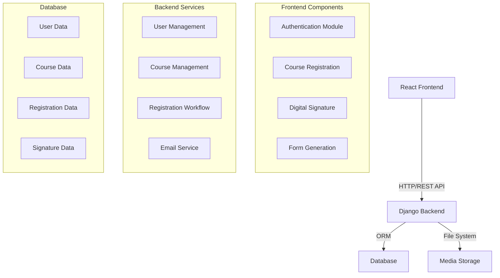
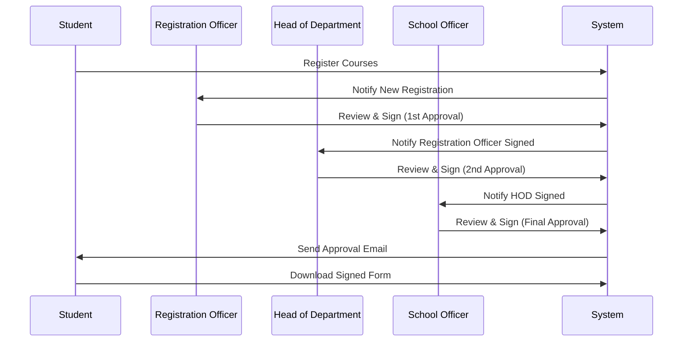

# Course Registration Portal - Technical Documentation

## Table of Contents
1. [System Overview](#1-system-overview)
2. [System Architecture](#2-system-architecture)
3. [User Roles and Permissions](#3-user-roles-and-permissions)
4. [Core Features](#4-core-features)
5. [Technical Implementation](#5-technical-implementation)
6. [Security Features](#6-security-features)
7. [Development and Deployment](#7-development-and-deployment)
8. [Future Enhancements](#8-future-enhancements)

## 1. System Overview

The Course Registration Portal is a modern web-based application designed to digitize and streamline the course registration process for academic institutions, specifically built for the Federal University of Technology, Akure (FUTA). The system replaces traditional paper-based registration with an efficient digital workflow.

### 1.1 Purpose
- Digitize course registration process
- Implement multi-level approval workflow
- Provide secure digital signature system
- Generate official course registration documents
- Streamline communication between stakeholders

### 1.2 Key Benefits
- Paperless registration process
- Real-time status tracking
- Automated email notifications
- Secure digital signatures
- Efficient approval workflow
- Reduced processing time

## 2. System Architecture

### 2.1 Technical Stack
- **Frontend**: 
  - React.js 18+ with TypeScript
  - Modern UI/UX design
  - Responsive layout
  - JWT authentication

- **Backend**:
  - Django 5.0.1
  - Django REST Framework
  - JWT token-based auth
  - Email notification system

- **Database**:
  - Development: SQLite
  - Production: PostgreSQL
  - Structured data model

- **File Storage**:
  - Local media storage
  - Digital signature storage
  - Document generation system

### 2.2 System Components



### 2.3 User Interaction Flow



## 3. User Roles and Permissions

### 3.1 Student
- **Access Rights**:
  - Browse available courses
  - Submit course registration
  - Track registration status
  - Download approved forms
  - Update personal profile

### 3.2 Registration Officer
- **Access Rights**:
  - First level of approval
  - Review student registrations
  - Manage course catalog
  - Upload digital signature
  - Access admin dashboard

### 3.3 Head of Department (HOD)
- **Access Rights**:
  - Second level of approval
  - Department-level oversight
  - Course management
  - Digital signature management
  - Department statistics access

### 3.4 School Officer
- **Access Rights**:
  - Final level of approval
  - Institution-wide oversight
  - Digital signature management
  - View approved registrations

## 4. Core Features

### 4.1 Course Registration Process
1. **Course Selection**
   - Browse available courses
   - Check prerequisites
   - Validate unit load
   - Submit registration

2. **Approval Workflow**
   - Registration Officer review
   - HOD approval
   - School Officer final sign-off
   - Status tracking
   - Email notifications

3. **Digital Signatures**
   - Secure signature upload
   - Signature verification
   - Sequential signing process
   - Watermarking

4. **Document Generation**
   - Dynamic form generation
   - Digital signature integration
   - Watermark application
   - PDF generation

### 4.2 Email Notification System
- **Notification Types**:
  - Registration submission
  - Approval stages
  - Final approval
  - Form availability
  - System updates

### 4.3 Course Management
- **Features**:
  - Course catalog
  - Department management
  - Prerequisites handling
  - Capacity control
  - Active/inactive status

## 5. Technical Implementation

### 5.1 Database Schema
- **Users Table**:
  ```sql
  - id (PK)
  - username
  - email
  - user_type
  - department_id (FK)
  - signature
  - other_profile_fields
  ```

- **Courses Table**:
  ```sql
  - id (PK)
  - code
  - title
  - department_id (FK)
  - units
  - capacity
  - prerequisites
  ```

- **Registrations Table**:
  ```sql
  - id (PK)
  - student_id (FK)
  - semester
  - status
  - created_at
  - updated_at
  ```

### 5.2 API Endpoints
```
Authentication:
POST /api/auth/login/
POST /api/auth/logout/
POST /api/auth/refresh/

User Management:
GET /api/me/
PUT /api/profile/update/
POST /api/upload/signature/

Course Management:
GET /api/courses/
GET /api/courses/departments/
GET /api/courses/registrations/status/

Registration:
POST /api/registrations/
GET /api/registrations/
PUT /api/registrations/{id}/approve/
POST /api/registrations/{id}/append-signature/

Forms:
GET /api/forms/course-form/{id}/
```

## 6. Security Features

### 6.1 Authentication
- JWT token-based authentication
- Role-based access control
- Session management
- Password encryption

### 6.2 Data Protection
- Encrypted storage
- Secure file handling
- Input validation
- CORS protection

### 6.3 API Security
- Token validation
- Rate limiting
- Request validation
- Error handling

## 7. Development and Deployment

### 7.1 Development Environment
- Python 3.13.5
- Node.js 22.16.0
- VS Code/PyCharm
- Git version control

### 7.2 Setup Instructions
```bash
# Backend Setup
python -m venv venv
source venv/bin/activate
pip install -r requirements.txt
python manage.py migrate
python manage.py runserver

# Frontend Setup
cd frontend
npm install
npm start
```

### 7.3 Deployment
- Production server configuration
- Database setup
- Static file serving
- Media file handling
- SSL/TLS setup

## 8. Future Enhancements

### 8.1 Planned Features
- Mobile application
- Real-time notifications
- Advanced analytics
- Bulk processing
- System integration

### 8.2 Scalability Plans
- Load balancing
- Caching implementation
- Database optimization
- API versioning
- Microservices architecture

---

## Appendix

### A. Sample Course Data
```json
{
  "code": "SEN506",
  "title": "Recent Development in Software Engineering",
  "description": "Current trends, research, and emerging practices in software engineering.",
  "department": {
    "name": "Software Engineering",
    "code": "SEN"
  },
  "level": 500,
  "semester": 2,
  "units": 2
}
```

### B. Default Credentials
```
Registration Officer:
- Username: admin
- Password: admin123

Head of Department:
- Username: HOD
- Password: HOD123

School Officer:
- Username: schoolofficer
- Password: schoolofficer123
```

### C. Contact Information
For technical support or inquiries:
- Email: support@courseregistration.edu
- Phone: +234-XXX-XXXX
- Website: https://courseregistration.edu

---
*Last Updated: July 10, 2025* 